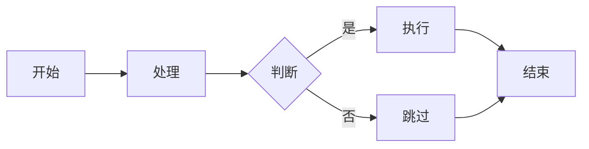
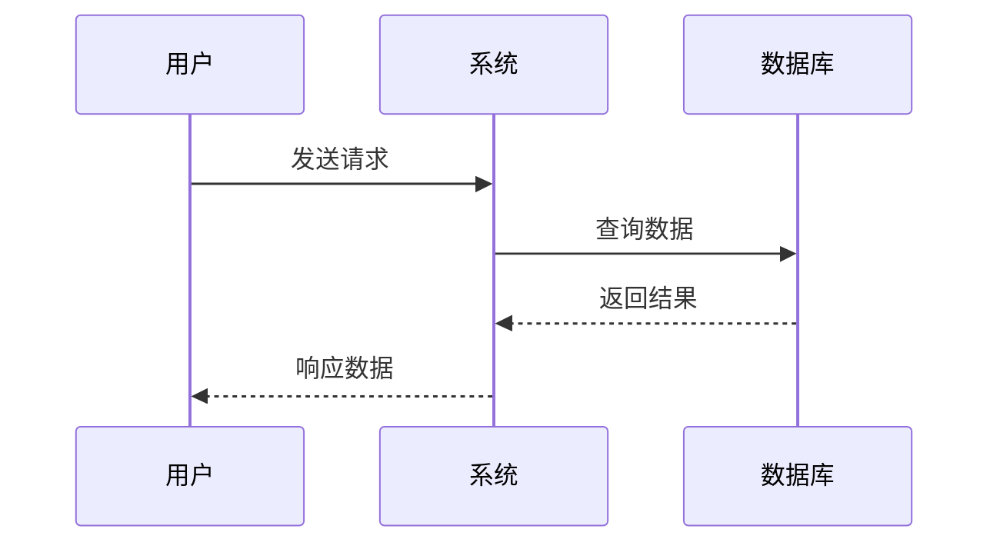
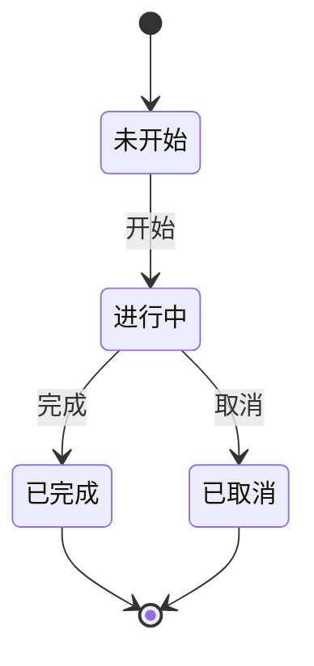
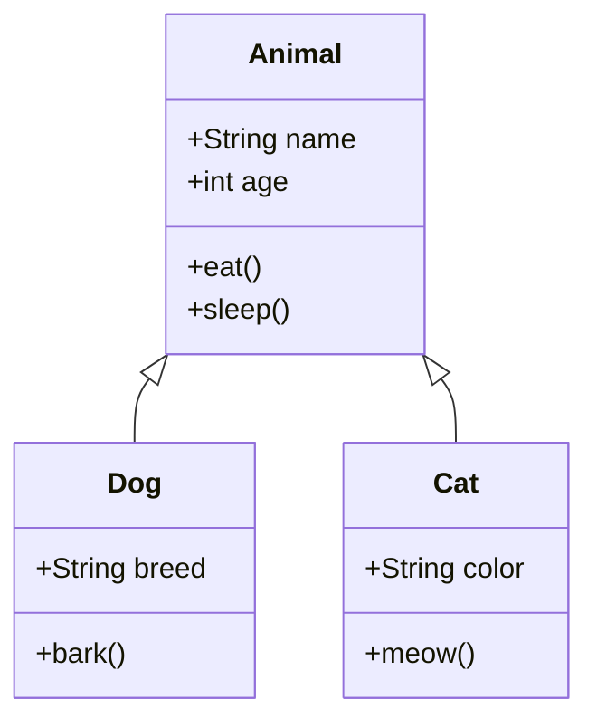

# 数学公式和流程图测试

## 这是一个上传测试

## 数学公式测试

### 行内公式
这是一个行内公式示例：$E = mc^2$，爱因斯坦的质能方程。

### 块级公式
欧拉公式：
$$ e^{i\pi} + 1 = 0 $$

二次方程求根公式：
$$ x = \frac{-b \pm \sqrt{b^2 - 4ac}}{2a} $$

积分公式：
$$ \int_{-\infty}^{\infty} e^{-x^2} dx = \sqrt{\pi} $$

矩阵示例：
$$
\begin{pmatrix}
a & b \\
c & d
\end{pmatrix}
$$

## 流程图测试

### 简单流程图

### 时序图

### 状态图

### 类图

